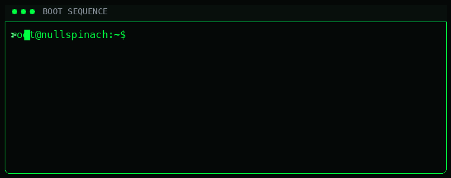
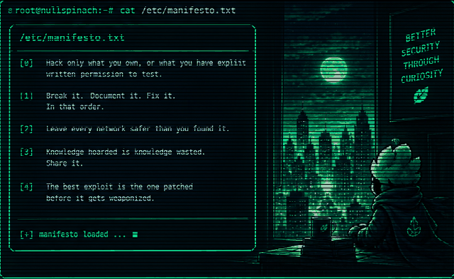
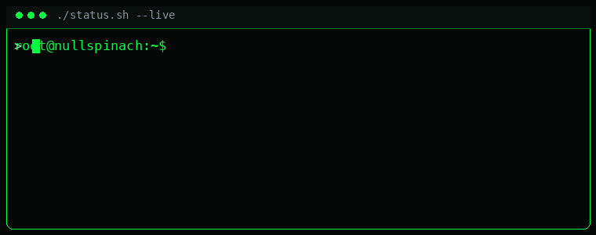
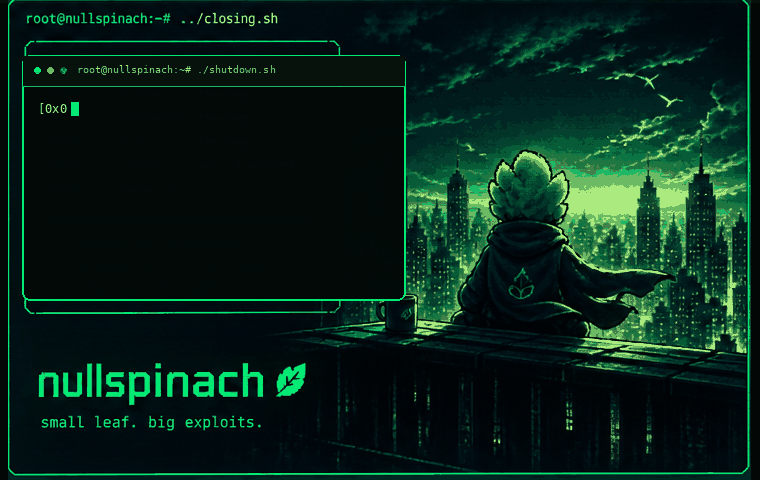

<!-- ========================================================= -->

<!--                         NULLSPINACH                       -->

<!-- ========================================================= -->

 

  

<code>root@nullspinach:~$ ./identity.sh</code>

  

<b>Offensive Security Researcher</b>
 • 
<b>Penetration Tester</b>
 • 
<b>AI Red-Teamer</b>

  

  

  

root@nullspinach:~$ whoami

nullspinach is what happens when a crashed process decides it would rather do security research.

I live somewhere between packets, processes, prompts, APIs, Linux shells and broken assumptions.

The interesting part isn't simply finding that something is vulnerable.

It's understanding why the system trusted the input, where the boundary failed, what can actually be reached, what evidence proves the issue, and how it can be fixed.

 

╭──────────────────────────────────────────────────────────────╮
│                    /etc/nullspinach.conf                    │
├──────────────────────────────────────────────────────────────┤
│                                                              │
│  alias        = nullspinach                                  │
│  shell        = bash                                         │
│  habitat      = /dev/null                                    │
│  mindset      = offensive / curious / paranoid              │
│  primary_lang = Python                                       │
│  side_effect  = questionable logs                            │
│  uptime       = ████████████████████████ 100%               │
│                                                              │
╰──────────────────────────────────────────────────────────────╯

root@nullspinach:~$ ./origin.sh

 

  

<code>[boot] sequence complete → process continues</code>

root@nullspinach:~$ cat /var/log/nullspinach.log

 

curiosity
   ↓
Linux / networking
   ↓
CTFs / enumeration
   ↓
web application security
   ↓
penetration testing
   ↓
offensive security research
   ↓
AI / LLM security
   ↓
multi-agent red teaming
   ↓
still digging

root@nullspinach:~$ cat /etc/manifesto.txt

 

root@nullspinach:~$ ./mindset.sh

 

  

<code>find → understand → reproduce → document → fix</code>

root@nullspinach:~$ tree ./arsenal

./arsenal
│
├── offensive
│   ├── Burp Suite
│   ├── Metasploit
│   ├── SQLmap
│   ├── Hashcat
│   └── John the Ripper
│
├── reconnaissance
│   ├── Nmap
│   ├── Wireshark
│   ├── Nessus
│   ├── Active Directory
│   └── custom Python / Bash tooling
│
├── ai-security
│   ├── Prompt Injection
│   ├── LLM Jailbreaking
│   ├── API Leakage
│   └── Multi-Agent Auditing
│
├── frameworks
│   ├── MITRE ATT&CK
│   ├── OWASP Top 10
│   ├── PTES
│   └── CVSS v3.1
│
└── languages
    ├── Python
    ├── Bash
    ├── Node.js
    ├── Java
    ├── Sockets
    └── Linux

 

root@nullspinach:~$ ./current_focus.sh

root@nullspinach:~$ ./status.sh --live

 

root@nullspinach:~$ git log --oneline --graph

* 0x09f  researching agentic AI security
* 0x08f  digging deeper into prompt injection
* 0x07f  breaking assumptions
* 0x06f  documenting what breaks
* 0x05f  learning cloud security
* 0x04f  grinding CTFs
* 0x03f  learning to think like an attacker
* 0x02f  learning to think like a defender
* 0x01f  discovering that everything is input
* 0x000  process initialized

root@nullspinach:~$ ./consume_contributions.sh

 

 

the snake is eating the contribution graph.

root@nullspinach:~$ ./research.log

root@nullspinach:~$ cat /etc/ops

╭────────────────────┬─────────────────────────────────────────╮
│ Area               │ Focus                                   │
├────────────────────┼─────────────────────────────────────────┤
│ Web Security       │ Application & API testing               │
│ Infrastructure     │ Network / service enumeration           │
│ AI Security        │ Prompt injection / agent testing        │
│ Red Teaming        │ Adversarial security research           │
│ CTF                │ Enumeration / exploitation / reversing  │
│ Development        │ Python / Bash / systems tooling         │
╰────────────────────┴─────────────────────────────────────────╯

root@nullspinach:~$ cat /etc/rules

01. curiosity > ego
02. evidence > assumptions
03. reproducibility > screenshots
04. disclosure > bragging
05. patch > persistence
06. understanding > memorization
07. learn something every time

 

root@nullspinach:~$ ./connect.sh

 

<pre>
$ ./connect.sh --target nullspinach

[+] email    : sohan.muhammed.cy@gmail.com
[+] linkedin : linkedin.com/in/nullspinach
[+] github   : github.com/nullspinach

[+] connection established
[+] identity hidden
[+] logs questionable

$ exit

Connection closed by nullspinach.

Stay paranoid. 🥬
</pre>

  

  

process 0x1337 · /dev/null · connection terminated

  

